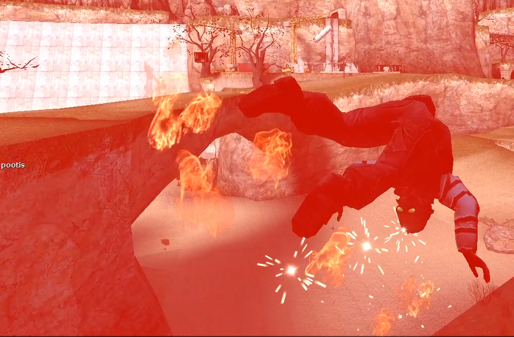

# Pootis Explosion



A simple addon that blows you up when you type in the chat "pootis".

For demonstration of practical application.

## Building

You will need [Charon](https://github.com/sigmasoldi3r/charon-lang) language
compiler to build this project. You can run `build.bat` in windows to run
charon.

Remember that `charon.exe` or Charon Language compiler binary must be in the
path! Otherwise you can just run:

```
charon src/pootisexplosion.crn -o pootis_explode/lua/autorun/server/pootisexplosion.lua --embed-runtime
```

Built with version `0.1.0-rc.1` of the compiler.
